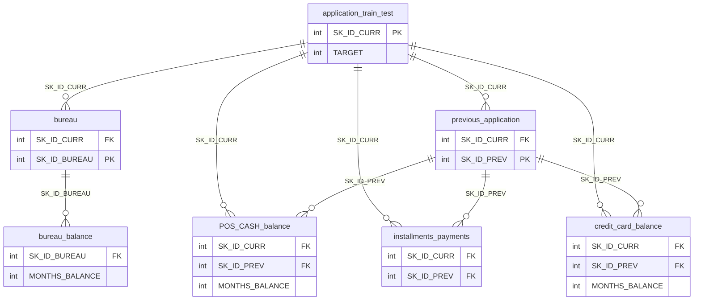

# Data dictionary

Column-level reference for the 8 source tables (Home Credit Default Risk dataset).
Column names keep the source dataset's original casing, per the project's
[naming convention](../CLAUDE.md) (`SK_ID_CURR`, `AMT_INCOME_TOTAL`, etc.), so
this dictionary stays traceable back to the raw CSVs, the Postgres tables, and
the Bronze Delta tables.

Table names below match the CSV/Postgres/Bronze names. `application_{train|test}`
covers both `application_train` and `application_test`, which share a schema
(`application_test` omits `TARGET`).

## Table overview

| Table | Grain | Purpose |
|---|---|---|
| `application_{train|test}` | One row per loan (`SK_ID_CURR`) | The main table — static data for all applications, split into Train (has `TARGET`) and Test (no `TARGET`) samples. |
| `bureau` | One row per client's previous credit reported to Credit Bureau | All of the client's previous credits from other financial institutions that were reported to Credit Bureau, for clients who have a loan in our sample. Each sample loan has as many `bureau` rows as the client had CB credits before the application date. |
| `bureau_balance` | One row per month of history per previous CB credit | Monthly balances of previous credits reported to Credit Bureau. Row count ≈ (# loans in sample × # related previous CB credits × # months of observable history per credit). |
| `POS_CASH_balance` | One row per month of history per previous Home Credit POS/cash loan | Monthly balance snapshots of the applicant's previous point-of-sale and cash loans with Home Credit. Row count ≈ (# loans in sample × # related previous credits × # months of observable history). |
| `credit_card_balance` | One row per month of history per previous Home Credit credit card | Monthly balance snapshots of the applicant's previous credit cards with Home Credit. Row count ≈ (# loans in sample × # related previous credit cards × # months of observable history). |
| `previous_application` | One row per previous Home Credit application | All previous Home Credit loan applications of clients who have a loan in our sample — one row per previous application, whether or not it led to a disbursed credit. |
| `installments_payments` | One row per installment payment made, plus one row per missed payment | Repayment history for previously disbursed Home Credit credits related to loans in our sample. One row = one payment of one installment, or one missed installment. |

## Table relationships

`bureau`, `POS_CASH_balance`, `installments_payments`, and `credit_card_balance`
all carry `SK_ID_CURR` directly (denormalized back to the main table) in
addition to reaching it transitively through `bureau_balance` → `bureau` or
`{POS_CASH_balance,installments_payments,credit_card_balance}` →
`previous_application`. This dual path is what the "Data quality" FK checks in
[CLAUDE.md](../CLAUDE.md) are validating in Silver — both routes to
`SK_ID_CURR` must agree.

## application_{train|test}

| Column | Description | Special |
|---|---|---|
| SK_ID_CURR | ID of loan in our sample | |
| TARGET | Target variable (1 = client with payment difficulties: late payment more than X days on at least one of the first Y installments of the loan in our sample, 0 = all other cases) | |
| NAME_CONTRACT_TYPE | Identification if loan is cash or revolving | |
| CODE_GENDER | Gender of the client | |
| FLAG_OWN_CAR | Flag if the client owns a car | |
| FLAG_OWN_REALTY | Flag if client owns a house or flat | |
| CNT_CHILDREN | Number of children the client has | |
| AMT_INCOME_TOTAL | Income of the client | |
| AMT_CREDIT | Credit amount of the loan | |
| AMT_ANNUITY | Loan annuity | |
| AMT_GOODS_PRICE | For consumer loans, the price of the goods for which the loan is given | |
| NAME_TYPE_SUITE | Who was accompanying client when applying for the loan | |
| NAME_INCOME_TYPE | Client's income type (businessman, working, maternity leave, ...) | |
| NAME_EDUCATION_TYPE | Level of highest education the client achieved | |
| NAME_FAMILY_STATUS | Family status of the client | |
| NAME_HOUSING_TYPE | Housing situation of the client (renting, living with parents, ...) | |
| REGION_POPULATION_RELATIVE | Normalized population of region where client lives (higher = more populated) | normalized |
| DAYS_BIRTH | Client's age in days at the time of application | time only relative to the application |
| DAYS_EMPLOYED | How many days before the application the person started current employment | time only relative to the application |
| DAYS_REGISTRATION | How many days before the application did client change his registration | time only relative to the application |
| DAYS_ID_PUBLISH | How many days before the application did client change the identity document used to apply | time only relative to the application |
| OWN_CAR_AGE | Age of client's car | |
| FLAG_MOBIL | Did client provide mobile phone (1=YES, 0=NO) | |
| FLAG_EMP_PHONE | Did client provide work phone (1=YES, 0=NO) | |
| FLAG_WORK_PHONE | Did client provide home phone (1=YES, 0=NO) | |
| FLAG_CONT_MOBILE | Was mobile phone reachable (1=YES, 0=NO) | |
| FLAG_PHONE | Did client provide home phone (1=YES, 0=NO) | |
| FLAG_EMAIL | Did client provide email (1=YES, 0=NO) | |
| OCCUPATION_TYPE | What kind of occupation does the client have | |
| CNT_FAM_MEMBERS | How many family members does client have | |
| REGION_RATING_CLIENT | Our rating of the region where client lives (1,2,3) | |
| REGION_RATING_CLIENT_W_CITY | Our rating of the region where client lives, taking city into account (1,2,3) | |
| WEEKDAY_APPR_PROCESS_START | On which day of the week did the client apply for the loan | |
| HOUR_APPR_PROCESS_START | Approximately at what hour did the client apply for the loan | rounded |
| REG_REGION_NOT_LIVE_REGION | Flag if client's permanent address ≠ contact address (region level) | |
| REG_REGION_NOT_WORK_REGION | Flag if client's permanent address ≠ work address (region level) | |
| LIVE_REGION_NOT_WORK_REGION | Flag if client's contact address ≠ work address (region level) | |
| REG_CITY_NOT_LIVE_CITY | Flag if client's permanent address ≠ contact address (city level) | |
| REG_CITY_NOT_WORK_CITY | Flag if client's permanent address ≠ work address (city level) | |
| LIVE_CITY_NOT_WORK_CITY | Flag if client's contact address ≠ work address (city level) | |
| ORGANIZATION_TYPE | Type of organization where client works | |
| EXT_SOURCE_1 | Normalized score from external data source | normalized |
| EXT_SOURCE_2 | Normalized score from external data source | normalized |
| EXT_SOURCE_3 | Normalized score from external data source | normalized |
| APARTMENTS_AVG / _MODE / _MEDI | Normalized building info: average / modus / median apartment size, common area, living area, building age, elevators, entrances, floors, building state | normalized |
| BASEMENTAREA_AVG / _MODE / _MEDI | " | normalized |
| YEARS_BEGINEXPLUATATION_AVG / _MODE / _MEDI | " | normalized |
| YEARS_BUILD_AVG / _MODE / _MEDI | " | normalized |
| COMMONAREA_AVG / _MODE / _MEDI | " | normalized |
| ELEVATORS_AVG / _MODE / _MEDI | " | normalized |
| ENTRANCES_AVG / _MODE / _MEDI | " | normalized |
| FLOORSMAX_AVG / _MODE / _MEDI | " | normalized |
| FLOORSMIN_AVG / _MODE / _MEDI | " | normalized |
| LANDAREA_AVG / _MODE / _MEDI | " | normalized |
| LIVINGAPARTMENTS_AVG / _MODE / _MEDI | " | normalized |
| LIVINGAREA_AVG / _MODE / _MEDI | " | normalized |
| NONLIVINGAPARTMENTS_AVG / _MODE / _MEDI | " | normalized |
| NONLIVINGAREA_AVG / _MODE / _MEDI | " | normalized |
| FONDKAPREMONT_MODE | " | normalized |
| HOUSETYPE_MODE | " | normalized |
| TOTALAREA_MODE | " | normalized |
| WALLSMATERIAL_MODE | " | normalized |
| EMERGENCYSTATE_MODE | " | normalized |
| OBS_30_CNT_SOCIAL_CIRCLE | How many observations of client's social surroundings with observable 30 DPD (days past due) default | |
| DEF_30_CNT_SOCIAL_CIRCLE | How many observations of client's social surroundings defaulted on 30 DPD | |
| OBS_60_CNT_SOCIAL_CIRCLE | How many observations of client's social surroundings with observable 60 DPD default | |
| DEF_60_CNT_SOCIAL_CIRCLE | How many observations of client's social surroundings defaulted on 60 DPD | |
| DAYS_LAST_PHONE_CHANGE | How many days before application did client change phone | |
| FLAG_DOCUMENT_2 .. FLAG_DOCUMENT_21 | Did client provide document N (20 flag columns) | |
| AMT_REQ_CREDIT_BUREAU_HOUR | Number of enquiries to Credit Bureau about the client one hour before application | |
| AMT_REQ_CREDIT_BUREAU_DAY | Number of enquiries to Credit Bureau one day before application (excl. one hour before) | |
| AMT_REQ_CREDIT_BUREAU_WEEK | Number of enquiries to Credit Bureau one week before application (excl. one day before) | |
| AMT_REQ_CREDIT_BUREAU_MON | Number of enquiries to Credit Bureau one month before application (excl. one week before) | |
| AMT_REQ_CREDIT_BUREAU_QRT | Number of enquiries to Credit Bureau 3 months before application (excl. one month before) | |
| AMT_REQ_CREDIT_BUREAU_YEAR | Number of enquiries to Credit Bureau one year before application (excl. last 3 months) | |

## bureau

| Column | Description | Special |
|---|---|---|
| SK_ID_CURR | ID of loan in our sample — one loan can have 0, 1, 2, or more related previous credits in credit bureau | hashed |
| SK_BUREAU_ID | Recoded ID of previous Credit Bureau credit related to our loan (unique per loan application) | hashed |
| CREDIT_ACTIVE | Status of the Credit Bureau (CB) reported credits | |
| CREDIT_CURRENCY | Recoded currency of the Credit Bureau credit | recoded |
| DAYS_CREDIT | How many days before current application did client apply for Credit Bureau credit | time only relative to the application |
| CREDIT_DAY_OVERDUE | Number of days past due on CB credit at the time of application for related loan | |
| DAYS_CREDIT_ENDDATE | Remaining duration of CB credit (days) at the time of application in Home Credit | time only relative to the application |
| DAYS_ENDDATE_FACT | Days since CB credit ended at the time of application (closed credit only) | time only relative to the application |
| AMT_CREDIT_MAX_OVERDUE | Maximal amount overdue on the CB credit so far (at application date) | |
| CNT_CREDIT_PROLONG | How many times was the CB credit prolonged | |
| AMT_CREDIT_SUM | Current credit amount for the CB credit | |
| AMT_CREDIT_SUM_DEBT | Current debt on CB credit | |
| AMT_CREDIT_SUM_LIMIT | Current credit limit of credit card reported in CB | |
| AMT_CREDIT_SUM_OVERDUE | Current amount overdue on CB credit | |
| CREDIT_TYPE | Type of CB credit (Car, cash, ...) | |
| DAYS_CREDIT_UPDATE | How many days before loan application did last info about the CB credit come | time only relative to the application |
| AMT_ANNUITY | Annuity of the CB credit | |

Note: `bureau.csv` calls the bureau credit ID column `SK_BUREAU_ID` in this
dictionary; the original Home Credit CSV header is `SK_ID_BUREAU`. Join key
into `bureau_balance` either way.

## bureau_balance

| Column | Description | Special |
|---|---|---|
| SK_BUREAU_ID | Recoded ID of Credit Bureau credit (unique per application) — joins to `bureau` | hashed |
| MONTHS_BALANCE | Month of balance relative to application date (-1 = freshest balance date) | time only relative to the application |
| STATUS | Status of CB loan during the month: active/closed/DPD buckets (`C`=closed, `X`=status unknown, `0`=no DPD, `1`=DPD 1-30, `2`=DPD 31-60, ... `5`=DPD 120+ or sold/written off) | |

## POS_CASH_balance

| Column | Description | Special |
|---|---|---|
| SK_ID_PREV | ID of previous credit in Home Credit related to loan in our sample (0, 1, 2, or more per loan) | |
| SK_ID_CURR | ID of loan in our sample | |
| MONTHS_BALANCE | Month of balance relative to application date (-1 = freshest monthly snapshot; 0 = info at application, often same as -1 since many banks don't update CB info regularly) | time only relative to the application |
| CNT_INSTALMENT | Term of previous credit (can change over time) | |
| CNT_INSTALMENT_FUTURE | Installments left to pay on the previous credit | |
| NAME_CONTRACT_STATUS | Contract status during the month | |
| SK_DPD | DPD (days past due) during the month of previous credit | |
| SK_DPD_DEF | DPD during the month with tolerance (low loan amounts ignored) | |

## credit_card_balance

| Column | Description | Special |
|---|---|---|
| SK_ID_PREV | ID of previous credit in Home Credit related to loan in our sample (0, 1, 2, or more per loan) | hashed |
| SK_ID_CURR | ID of loan in our sample | hashed |
| MONTHS_BALANCE | Month of balance relative to application date (-1 = freshest balance date) | time only relative to the application |
| AMT_BALANCE | Balance during the month of previous credit | |
| AMT_CREDIT_LIMIT_ACTUAL | Credit card limit during the month | |
| AMT_DRAWINGS_ATM_CURRENT | Amount drawn at ATM during the month | |
| AMT_DRAWINGS_CURRENT | Amount drawn during the month | |
| AMT_DRAWINGS_OTHER_CURRENT | Amount of other drawings during the month | |
| AMT_DRAWINGS_POS_CURRENT | Amount drawn/buying goods during the month | |
| AMT_INST_MIN_REGULARITY | Minimal installment for this month | |
| AMT_PAYMENT_CURRENT | How much the client paid during the month on the previous credit | |
| AMT_PAYMENT_TOTAL_CURRENT | How much the client paid during the month in total | |
| AMT_RECEIVABLE_PRINCIPAL | Amount receivable for principal | |
| AMT_RECIVABLE | Amount receivable | |
| AMT_TOTAL_RECEIVABLE | Total amount receivable | |
| CNT_DRAWINGS_ATM_CURRENT | Number of ATM drawings during the month | |
| CNT_DRAWINGS_CURRENT | Number of drawings during the month | |
| CNT_DRAWINGS_OTHER_CURRENT | Number of other drawings during the month | |
| CNT_DRAWINGS_POS_CURRENT | Number of drawings for goods during the month | |
| CNT_INSTALMENT_MATURE_CUM | Number of paid installments on the previous credit | |
| NAME_CONTRACT_STATUS | Contract status (active, signed, ...) | |
| SK_DPD | DPD during the month | |
| SK_DPD_DEF | DPD during the month with tolerance (low loan amounts ignored) | |

## previous_application

| Column | Description | Special |
|---|---|---|
| SK_ID_PREV | ID of previous credit in Home Credit related to loan in our sample (previous application doesn't necessarily lead to credit) | hashed |
| SK_ID_CURR | ID of loan in our sample | hashed |
| NAME_CONTRACT_TYPE | Contract product type (Cash loan, consumer loan [POS], ...) | |
| AMT_ANNUITY | Annuity of previous application | |
| AMT_APPLICATION | For how much credit did client ask on the previous application | |
| AMT_CREDIT | Final credit amount on the previous application (may differ from AMT_APPLICATION — approval process could grant a different amount) | |
| AMT_DOWN_PAYMENT | Down payment on the previous application | |
| AMT_GOODS_PRICE | Goods price the client asked for (if applicable) | |
| WEEKDAY_APPR_PROCESS_START | Day of week client applied for previous application | |
| HOUR_APPR_PROCESS_START | Approx. hour of day client applied for previous application | rounded |
| FLAG_LAST_APPL_PER_CONTRACT | Flag if this was the last application for the previous contract | |
| NFLAG_LAST_APPL_IN_DAY | Flag if this was the client's last application that day | |
| NFLAG_MICRO_CASH | Flag: micro finance loan | |
| RATE_DOWN_PAYMENT | Down payment rate on previous credit | normalized |
| RATE_INTEREST_PRIMARY | Interest rate on previous credit | normalized |
| RATE_INTEREST_PRIVILEGED | Interest rate on previous credit | normalized |
| NAME_CASH_LOAN_PURPOSE | Purpose of the cash loan | |
| NAME_CONTRACT_STATUS | Contract status (approved, cancelled, ...) | |
| DAYS_DECISION | When the decision about previous application was made, relative to current application | time only relative to the application |
| NAME_PAYMENT_TYPE | Payment method client chose for the previous application | |
| CODE_REJECT_REASON | Why the previous application was rejected | |
| NAME_TYPE_SUITE | Who accompanied client when applying for the previous application | |
| NAME_CLIENT_TYPE | Was the client old or new when applying for the previous application | |
| NAME_GOODS_CATEGORY | Kind of goods the client applied for | |
| NAME_PORTFOLIO | Was the previous application for CASH, POS, CAR, ... | |
| NAME_PRODUCT_TYPE | Was the previous application x-sell or walk-in | |
| CHANNEL_TYPE | Channel through which the client was acquired | |
| SELLERPLACE_AREA | Selling area of seller place | |
| NAME_SELLER_INDUSTRY | Industry of the seller | |
| CNT_PAYMENT | Term of previous credit at application | |
| NAME_YIELD_GROUP | Interest rate grouped into low/medium/high | grouped |
| PRODUCT_COMBINATION | Detailed product combination | |
| DAYS_FIRST_DRAWING | First disbursement date, relative to current application date | time only relative to the application |
| DAYS_FIRST_DUE | First due date (expected), relative to current application date | time only relative to the application |
| DAYS_LAST_DUE_1ST_VERSION | First due date (original version), relative to current application date | time only relative to the application |
| DAYS_LAST_DUE | Last due date, relative to current application date | time only relative to the application |
| DAYS_TERMINATION | Expected termination date, relative to current application date | time only relative to the application |
| NFLAG_INSURED_ON_APPROVAL | Did the client request insurance during the previous application | |

## installments_payments

| Column | Description | Special |
|---|---|---|
| SK_ID_PREV | ID of previous credit in Home Credit related to loan in our sample (0, 1, 2, or more per loan) | hashed |
| SK_ID_CURR | ID of loan in our sample | hashed |
| NUM_INSTALMENT_VERSION | Version of installment calendar (0 = credit card); a version change signals a payment-calendar parameter changed | |
| NUM_INSTALMENT_NUMBER | Which installment this payment observation is for | |
| DAYS_INSTALMENT | When the installment was supposed to be paid, relative to current application date | time only relative to the application |
| DAYS_ENTRY_PAYMENT | When the installment was actually paid, relative to current application date | time only relative to the application |
| AMT_INSTALMENT | Prescribed installment amount | |
| AMT_PAYMENT | What the client actually paid on this installment | |

## Notes for Silver/Gold work

- Grain per table: `application_{train|test}` and `bureau` are keyed at
  `SK_ID_CURR`; `bureau_balance` is keyed at `SK_BUREAU_ID` + `MONTHS_BALANCE`;
  `POS_CASH_balance`, `credit_card_balance`, `installments_payments` are keyed
  at `SK_ID_PREV` + `MONTHS_BALANCE`/installment number; `previous_application`
  is keyed at `SK_ID_PREV`.
- Referential integrity to check in Silver (per [CLAUDE.md](../CLAUDE.md) "Data
  quality"): every `SK_BUREAU_ID`/`SK_ID_BUREAU` in `bureau_balance` must exist
  in `bureau`; every `SK_ID_PREV` in `POS_CASH_balance`,
  `credit_card_balance`, and `installments_payments` must exist in
  `previous_application`.
- All `DAYS_*` fields are negative integers counted backward from the current
  application date (not calendar dates) — plan Silver-layer conversions
  (e.g. to an approximate age or duration) accordingly rather than treating
  them as literal dates.
- `_AVG` / `_MODE` / `_MEDI` suffixes on the building-info block in
  `application_{train|test}` are three normalized views (average, modus,
  median) of the same set of ~20 underlying building attributes — worth
  aggregating/selecting as a block rather than column-by-column in Gold.
