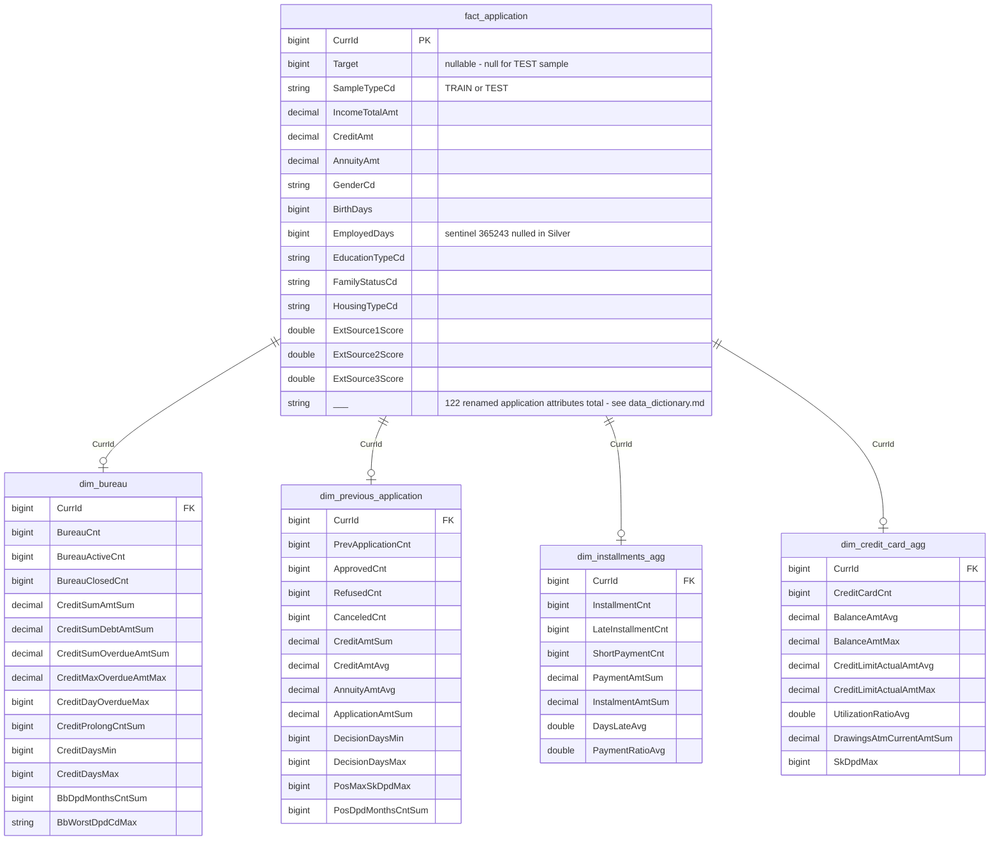

# Gold star schema — ER diagram

Grain: 1 row per applicant (`CurrId`, i.e. `SK_ID_CURR`) in `fact_application`.
Each dimension is pre-aggregated to `CurrId` grain in `src/lakehouse/gold.py`
(see [`GoldAggregationJob`](../src/lakehouse/gold.py) and its 5 subclasses),
so no fan-out happens when joining `fact_application` to a dimension.

## Why the relationships are optional (`o|`), not `||--||`

`CLAUDE.md`'s architecture summary describes each dimension as joining to
`fact_application` "1:1" — true for row *shape* (no fan-out), but not for row
*coverage*. Each `Gold*Job.transform()` (`src/lakehouse/gold.py`) does a plain
`groupBy("CurrId")` over rows that exist in that satellite table, so an
applicant with **zero** rows in a satellite table gets **no row at all** in
that dimension — not a zero-filled row. (Zero-fill only applies to count/sum
*columns* for a `CurrId` that already has a dimension row but is missing one
piece of it, e.g. bureau history with no `bureau_balance` months — see "Data
quality" in `CLAUDE.md`.)

This is visible directly in the verified row counts (`CLAUDE.md` "Status",
2026-08-15 run):

| Table | Rows | Coverage vs. `fact_application` |
|---|---|---|
| `fact_application` | 356,255 | 100% (356,255 = 307,511 train + 48,744 test) |
| `dim_previous_application` | 338,857 | ~95% — applicants with ≥1 prior Home Credit application |
| `dim_installments_agg` | 336,935 | ~95% — applicants with ≥1 installment payment record |
| `dim_bureau` | 305,811 | ~86% — applicants with ≥1 bureau-reported credit |
| `dim_credit_card_agg` | 92,447 | ~26% — applicants with ≥1 Home Credit credit card |

Practical implication for downstream consumers (Power BI / Databricks SQL):
join `fact_application` to each dimension with a **left join** on `CurrId`,
and treat `NULL` aggregate columns post-join as "no history in that table,"
not missing data.

## Source-table relationships

See [`data_dictionary.md`](data_dictionary.md#table-relationships) for the
Bronze/Silver-level ER diagram of the 8 raw source tables that these 5 Gold
outputs are built from.
